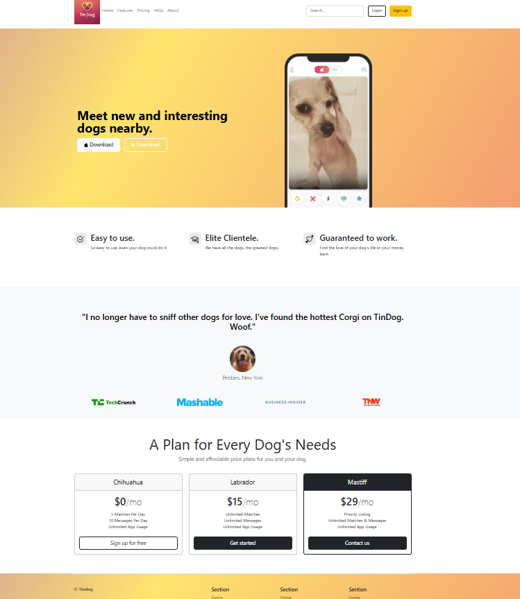

# Tin Dog 🐶
A simple "Tinder for Dogs" project built with Bootstrap!

## About
Tin Dog is a playful project inspired by the concept of Tinder, but for dogs! This project was created as a way to practice and improve my Bootstrap skills. There is no JavaScript or backend functionality at the moment—it's purely a front-end prototype to explore Bootstrap's features and layout design.

This project was inspired by Dr. Angela Yu's Udemy course, which provided a great foundation for learning and applying web development concepts.

While Bootstrap may not be as popular today with modern CSS frameworks, I wanted to revisit and practice using it.

## Features
- Responsive Design: Works across desktop, tablet, and mobile devices.
- Bootstrap Components: Utilizes Bootstrap for styling, grids, and responsiveness.
- Playful Concept: A fun UI mimicking a dating app for dogs.
- CSS Gradient Background: The project features an attractive gradient background to enhance the visual appeal.

## Technologies Used
- HTML5
- CSS3
- Bootstrap 5

## Preview

## Future Improvements
- Add interactivity using JavaScript.
- Include backend functionality for user data.
- Enhance the design with modern frameworks or libraries.

## Acknowledgments
This project was inspired by Dr. Angela Yu's Complete Web Development Bootcamp on Udemy. Her course is an excellent resource for beginners and helped shape the concepts applied in this project.

## Why Bootstrap?
Bootstrap may not be as popular today with modern CSS frameworks, but it's a great tool for beginners and offers a quick way to create responsive layouts. This project helped me revisit its concepts and experiment with its features.

## Feedback
Feel free to open issues or contribute suggestions to improve this project!

